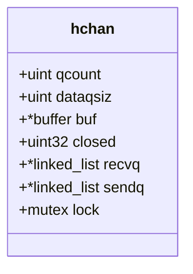
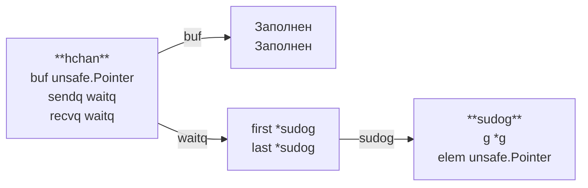

# Отдельный топик про каналы

Канал — это объект связи, с помощью которого горутины обмениваются данными. Также его используют для передачи сигналов (например системных в graceful shutdown). Важно помнить, что если  перелаём данные через буферизированную очередь, то передаваемые горутинами значения копируются в буфер.



- qcount — количество элементов в буфере
- dataqsiz — размерность буфера
- buf — указатель на цикличный буфер для элементов канала
- closed — флаг, указывающий, закрыт канал или нет
- recvq — указатель на связанный список горутин, ожидающих чтения из канала
- sendq -указатель на связанный список горутин, ожидающих запись в канал
- lock — мьютекс для безопасного доступа к каналу

В общем случае, горутина захватывает мьютекс, когда совершает какое-либо действие с каналом, кроме случаев lock-free проверок при неблокирующих вызовах.

## Оптимизация записи
Одна горутина пишет в стек другой горутины если рассматриваем небуферизированные каналы.

## Закрытие канала
Закрытие канала это простая операция. Go проходит по всем ожидающим на чтение или запись горутинам и разблокирует их. Все получатели получают оставшиеся данные, а после дефолтные значение переменных того типа данных канала, а все отправители паникуют.

## Deadlock
Чтение или запись данных в канал блокирует горутину и контроль передается свободной горутине. Если такие горутины отсутствуют, то возникает deadlock, который приводит кк завершению программы.

## DataRace
Иногда, необходимо использовать общие данные между несколькими горутинами. В этом случае несколько горутин пытаются взаимодействовать с данными в общей области памяти, что иногда приводит к непредсказуемому результату.

## Некоторые паттерны конкурентного программирования
### Генератор
Генерация значений(особенно тяжеловесных) для канала, которые можно выполнить конкурентно.

### Fan-in
Стратегия мультиплексирования, при которой входы нескольких каналов объединяются в один выходной канал.

### Fan-out
Обратная операция, при которой один канал разделяется на несколько каналов.

## Создание канала
Функция makechan выделяет память под структуру hchan в куче, инициализирует эту структуру, и возвращает указатель.

И несмотря на то, что в go все передается по значению, передавать канал по ссылке бессмысленно, потому что под капотом канал — это и есть указатель.

## Подробно про процесс блокировки при чтении и записи
### Запись

Когда горутина осуществляет попытку записи в канал, буфер которого полон, рантайм переводит эту горутину в состояние “waiting”. Введём доп структуру
```go
// sudog представляет заблокированную горутину, ожидающую чтения или записи
type sudog struct {
    g *g                    // ссылка на горутину
    elem     unsafe.Pointer // данные для записи
    next *sudog // указатель на следующий элемент
    // ...
}
```

```go
// указатель на начало и конец связного списка
type waitq struct{
    first *sudog
    last *sudog 
}
```



Мы видим, что канал содержит в себе ссылку на ожидающую горутину, представленную структурой sudog. Эта структура помещается в односвязный список waitq. И когда буфер становится доступным для заполнения, происходит следующее:

- очередная структура, представляющая ожидающую горутину sudog извлекается из списка waitq;
- данные из поля elem добавляются в буфер канала;
- горутина из sudog переходит из состояния “waiting” в состояние “runnable” (готова к выполнению).

### Чтение
При чтении данные пишутся в стек читающей горутины минуя буфер - send direct оптимизация.