# GC

## Mark and sweep
- Mark: находим и отмечаем все достижимые объекты из набора (например, в куче).

- Sweep: проходим по всем объектам в куче, затираем недостижимые и возвращаем их в пул свободной памяти.

Этот алгоритм похож на обход в ширину.
В Golang память отмечается доступной для перезаписи, запускается горутина, которая постепенно возвращает её системе. За этот процесс отвечает Scavenger.

## Stop the world
Пауза, необходимая для разметки элементов в куче и сборки мусора.

## Three-color marker algorithm
Способ уменьшить вызов STW посредством трёхцветной маркировки.
- Белый - потенциальный мусор, ещё не затронутые алгоритмом объекты

- Серый - объекты на "рассмотрении"

- Черный - активные объекты

### Имплементация алгоритма
В целом, алгоритм можно представить циклом из нескольких шагов:

- Покрасить все корневые объекты (стек и глобальные переменные) в серый.

- Выбрать серый объект из набора серых объектов и пометить его как чёрный.

- Все объекты, на которые указывает чёрный объект, пометить серым. Это гарантирует, что сам объект и объекты, на которые он ссылается, не будут выброшены в мусор.

- Если в графе остались серые объекты, вернуться к шагу 2.

Но есть большая проблема: если в процессе работы связать чёрный объект и белый(допустим ссылка от чёрного к белому).

## Амортизация алгоритма
Осуществляется посредством WriteBarrier, то есть инкрементально собираем мусор, не используя STW -> Incremental Garbage Collector.

### Write Barrier
Фрагмент кода, который выполняется при работе с памятью. Нам он нужен для поддержки инвариантов, которые гарантируют правильное пошаговое выполнение алгоритма.

```go
// Dijkstra insertion write barrier
func writePointer(slot, ptr):
    // shade превращает белые объекты в серые, остальные не трогает
    shade(ptr) // значение, помещаемое в место назначения
    *slot = ptr // место назначения
```
Очевидно, что триггер для вызова функции - это создание связи между объектами.

Таким образом поддерживаем инвариант:
- Чёрные объекты указывают только на серые или чёрные

#### В контексте стека
Все объекты для упрощения считаются серыми, при необходимости проходимся в конце GC по всему стеку и останавливаем его по STW и красим объекты в серый.

#### Dijkstra insertion write barrier + Yuasa deletion write barrier

```go
func writePointer(slot, ptr)
   shade(slot)
   slot = ptr
```

Добавляем ещё один инвариант (у любого белого объекта, на который будет указывать чёрный объект, должен быть достижимый путь от серого объекта).

И таким образом получаем гибридный write barrier:
```go
func writePointer(slot, ptr):
    shade(*slot)
    shade(ptr)
    *slot = ptr
```

Это позволяет отказаться от STW при повторном сканировании стеков — главная цель гибридного барьера. Стек конкретной горутины сканируется один раз при её остановке, и больше трогать его не нужно, потому что:

- новые объекты сразу чёрные — не потеряются

- deletion barrier защищает от удаления ссылок на стеке

#### Пример различия shade(ptr),shade(slot)
```go
/*
Начальное состояние:
A (чёрный) — уже обработан GC
B (серый)  — в очереди GC
C (белый)  — ещё не видел GC

A.ref = B
B.ref = C

B.ref = nil  // удаляем ссылку B → C
A.ref = C    // добавляем ссылку A → C

Разберём каждую запись с гибридным барьером.

---

**Запись 1: `B.ref = nil`**

slot = &B.ref   // адрес поля ref в объекте B
*slot = C        // что сейчас лежит в слоте — старое значение
ptr = nil      // что пишем

shade(*slot) → shade(C) → C становится серым   ← yuasa сработал
shade(ptr)   → shade(nil) → ничего не делаем

C теперь серый — GC его не потеряет, даже если B больше на него не указывает.

---

**Запись 2: `A.ref = C`**
slot  = &A.ref   // адрес поля ref в объекте A
*slot = B        // что сейчас лежит в слоте — старое значение
ptr = C        // что пишем

shade(*slot) → shade(B) → B уже серый, ничего не меняется
shade(ptr)   → shade(C) → C уже серый после шага 1, ничего не меняется

---

**Итоговое состояние**
A (чёрный) → C (серый)
B (серый)  → nil
C (серый)  — GC обойдёт его и пометит чёрным

C жив и будет корректно обработан GC.

---

**Что было бы без одного из барьеров**

Только `shade(ptr)` — Dijkstra без Yuasa:
запись B.ref = nil:
    shade(*slot) — нет, не делаем
    shade(nil)   — ничего
    C остаётся белым

запись A.ref = C:
    shade(C) → C становится серым

итог: C серый — окей, в этом сценарии повезло

Но вот сценарий где только Dijkstra проваливается:
B (серый) → C (белый)
A (чёрный) — не трогает C вообще

мутатор: B.ref = nil  // просто удаляет ссылку, никуда C не перекладывает

shade(ptr) = shade(nil) — ничего не делает
C остался белым, никто на него не указывает — GC соберёт живой объект

Только `shade(*slot)` — Yuasa без Dijkstra:
запись A.ref = C:
    shade(*slot) → shade(B) → B уже серый
    shade(ptr) — нет, не делаем
    C остаётся белым
    A (чёрный) теперь указывает на C (белый) — нарушение инварианта

если B.ref = nil произошло раньше:
    C достижим только из чёрного A и остаётся белым
    GC соберёт живой объект
*/
```

Все объекты, создаваемые во время работы GC объявляются чёрными.

## Concurrent GC

Иногда инкрементальные паузы на всех процессорах будут в один момент времени -> это приводит к STW.

## Стадии работы GC в Go
С запуска программы до первого GC:
1. Старт программы
Runtime инициализируется, gcphase = _GCoff. Write Barrier выключен. Все новые объекты аллоцируются белыми.
2. Аллокация в куче
Объекты создаются через mallocgc. GC не запущен — никакой маркировки, просто выдача памяти из mspan через mcache → mcentral → mheap.
3. Триггер
Куча достигла лимита GOGC, или прошло 2 минуты, или вызван runtime.GC(). Runtime решает запустить GC.
4. Sweep Termination — STW
Все горутины доходят до безопасной точки. Остатки мусора прошлого цикла (при первом запуске их нет) отдаются Scavenger'у.
5. Mark — конкурентно
gcphase = _GCmark. Write Barrier включается. Корневые объекты (глобальные переменные, стеки горутин) помещаются в очередь. Мир запускается. Воркеры-маляры обходят граф объектов. Новые объекты теперь создаются чёрными (mallocgc проверяет gcphase != _GCoff).
6. Mark Termination — STW
gcphase = _GCmarktermination. Серые объекты кончились. Воркеры останавливаются. Runtime чистит внутренние структуры.
7. Sweep — конкурентно
gcphase = _GCoff. Write Barrier выключается. Новые объекты снова белые. Фоновая горутина-sweeper проходит по мусорным mspan и помечает их доступными для переиспользования. Scavenger постепенно возвращает память ОС.
8. Возврат к шагу 2
Программа работает, аллоцирует. Ждём следующего триггера.

## Green Tea GC — конспект статьи

### Проблема: 35% CPU впустую

Текущий GC в Go тратит ~35% CPU-циклов на **ожидание памяти** (memory stalls).

Причина — **плохая пространственная локальность (spatial locality)**:
GC прыгает за объектами в случайные адреса памяти → постоянные **cache misses** → CPU простаивает сотни циклов, пока данные грузятся из DRAM.

- Небольщой ликбез по циклам процессора:
Современный CPU работает на частоте, например, 3 ГГц — это 3 миллиарда тактов в секунду. Один такт = один цикл. Процессор физически не может читать RAM мгновенно — это отдельная микросхема далеко на плате, до неё нужно время. Поэтому придумали кэши прямо внутри чипа:
```
L1 cache  →  ~1–4 цикла      (внутри ядра, ~64 КБ)
L2 cache  →  ~10–20 циклов   (рядом с ядром, ~512 КБ)
L3 cache  →  ~40–60 циклов   (общий на все ядра, ~16 МБ)
RAM/DRAM  →  ~200–400 циклов (отдельная микросхема)
```

Процессор просит данные → их нет в L1 → нет в L2 → нет в L3 → идём в RAM. Пока RAM отвечает, CPU буквально останавливается и ждёт эти ~300 циклов — за это время он мог бы выполнить сотни других инструкций.
Применительно к GC
Текущий GC прыгает от объекта к объекту по случайным адресам. Объект A живёт по адресу 0x1000, объект B — по 0xF4A00. С высокой вероятностью B нет ни в одном кэше → cache miss → 300 циклов простоя → следующий объект → снова cache miss → и так миллионы раз за один GC-проход. Green Tea решает это тем, что объекты внутри одного span лежат рядом в памяти. Загрузил span в кэш один раз — и следующие 10 объектов из него достаются уже за 1 цикл.

### Tri-Colour Mark & Sweep (как работает сейчас)

| Цвет | Значение |
|------|----------|
| Белый | Объект ещё не посещён (потенциальный мусор) |
| Серый | Посещён, но дети ещё не обработаны |
| Чёрный | Посещён, все дети обработаны |

**Mark phase:** обходим граф объектов, красим их  
**Sweep phase:** всё, что осталось белым — мусор, удаляем


### Green Tea GC — решение

Доступен как **эксперимент в Go 1.25** (ожидаемый релиз: август 2025).

```bash
GOEXPERIMENT=greenteagc go build
```

### Ключевая идея: Spans (блоки памяти)

Вместо того чтобы прыгать по отдельным объектам, Green Tea группирует память в **spans** и обрабатывает их целиком.

**Результат:** при одном cache miss в кэш загружается сразу весь span — следующие объекты в нём уже в кэше.

### Оптимизация: Representative Object

Проблема: что если в span только один помеченный объект? Обрабатывать весь span неэффективно.

Решение — адаптивное поведение:

```
Есть hit flag у каждого span

hit flag = true  → много объектов помечено → обрабатываем весь span (максимальная локальность)
hit flag = false → один объект            → обрабатываем только representative object
```

### Бонусы
- **Work-stealing** — механизм балансировки нагрузки между горутинами (аналог планировщика Go) - то есть при наличии большого числа span-ов у потока можем перебросить часть на другой поток.
- Прототипы **SIMD-ускоренного** сканирования памяти - обработка нескольких объектов данных в span-e за раз, то есть вместо итерации, например, по четырём 64 битным объектам обрабатываем их за 1 цикл.