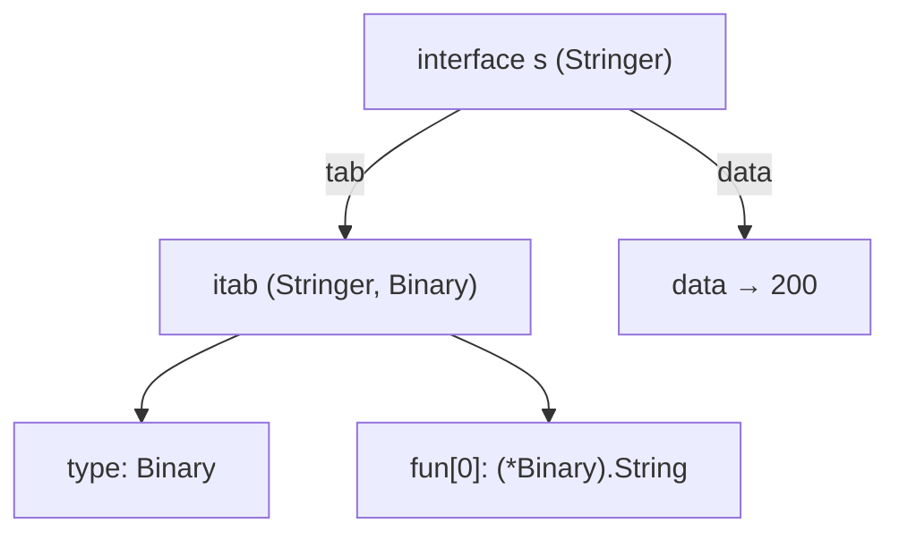
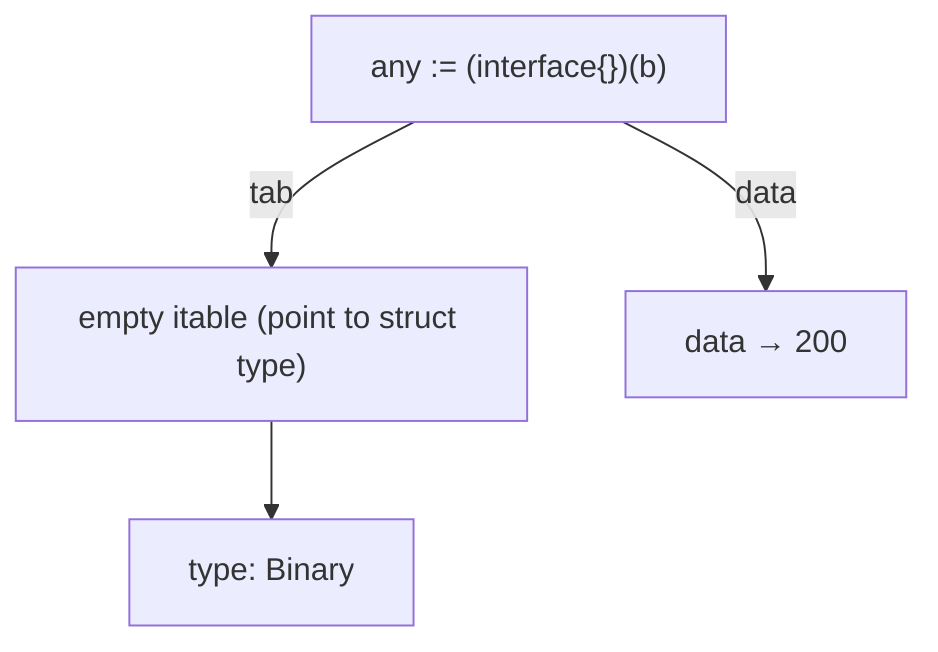
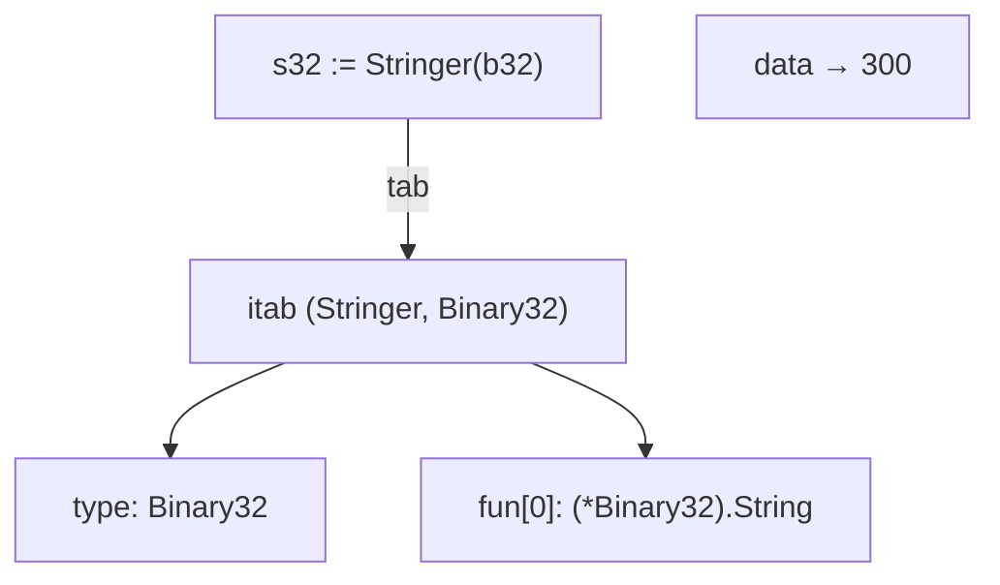

# Go: Interface

Интерфейсы Go — статические, проверяемые во время компиляции, динамические по запросу.

## Утиная типизация
Интерфейсы Go позволяют использовать утиную типизацию, как в чисто динамическом языке, таком как Python, но при этом компилятор всё равно будет обнаруживать очевидные ошибки.

## Таблицы для вызовов методов
- Статически: подготовка таблиц для всех вызовов методов(C++, Java)
- Динамически: поиск метода при каждом вызове (Smalltalk)
- Go: таблицы методов вычисляются динамически во время выполнения


## Устройство интерфейса
Значения интерфейса представляются в виде пары из двух слов, дающих указатель на информацию о типе, хранящуюся в интерфейсе, и указатель на связанные с ним данные.

```go
// тип интерфейса - статический
// тип структуры - динамический
type iface struct {
	tab  *itab
	data unsafe.Pointer
}
```




### Первое слово
Первое слово в значении интерфейса указывает на то, что я называю таблицей интерфейсов (таблица с метаданными). Itable начинается с некоторых метаданных о задействованных типах, а затем становится списком указателей на функции. Обратите внимание, что итаблица соответствует типу интерфейса. 

### Второе слово
Второе слово указывает на фактические данные.
``` go
var s Stringer = b // присваивание создаёт копии
```

Значения, хранящиеся в интерфейсах, могут быть произвольно большими, но для хранения значения в структуре интерфейса выделяется только одно слово, поэтому присваивание выделяет фрагмент памяти в куче и записывает указатель в однословный слот. 

Для вызова функции s.String()компилятор Go генерирует код, эквивалентный выражению C s.tab->fun[0](s.data): он вызывает соответствующий указатель на функцию из таблицы итераций, передавая слово данных значения интерфейса в качестве первого (в этом примере — единственного) аргумента функции. 

## Вычисление таблицы
Компилятор генерирует структуру описания типа для каждого конкретного типа. Среди прочих метаданных структура описания типа содержит список методов, реализованных этим типом. Аналогично, компилятор генерирует (другую) структуру описания типа для каждого типа интерфейса: она также содержит список методов. Среда выполнения интерфейса вычисляет таблицу типов, ища каждый метод, перечисленный в таблице методов типа интерфейса, в таблице методов конкретного типа. И выполняется кэширование.

## Оптимизации
### Оптимизация памяти по таблице
Если используемый тип интерфейса пуст(interface{}) — у него нет методов — то itable не выполняет никакой функции, кроме хранения указателя на исходный тип.



### Оптимизация памяти по данным
Если значение, связанное со значением интерфейса, помещается в одно машинное слово, нет необходимости вводить косвенную адресацию или выделение памяти в куче. 



То, указывается ли фактическое значение или встраивается, зависит от размера типа.

- Пустые интерфейсы используют обе оптимизации

## Интересная ситуация с nil и интерфейсами

Переменные в Go всегда инициализируются значением. Это относится и к интерфейсам. Стоит отметить, что интерфейсы реализованы в виде двух элементов: itable(T) и указатель на значение(V). Значение интерфейса будет nil только в том случае, если V и T оба будут nil.

