# Scheduler Go

## Планировщик OS
Механизм на уровне runtime, который управляет распределением горутин между физическими потоками ОС.

Каждая программа, которую мы запускаем, создаёт процесс, и каждому процессу присваивается его начальный поток. У процесса может быть несколько потоков. Все они выполняются независимо друг от друга, и решения о планировании принимаются на уровне потока, а не на уровне процесса. Потоки могут выполняться **конкурентно** (на одном ядре) или **параллельно** (каждый из них выполняется одновременно на разных ядрах).

Планировщик OS отвечает за то, чтобы ядра не простаивали, если есть потоки, которые могут выполняться. Его задача — создавать иллюзию того, что все потоки выполняются одновременно. Планировщик OS является **недетерминированным** — мы не можем предсказать, что он будет делать в тот или иной момент.

### Состояния потоков (Thread States)

| Состояние     | Описание |
|---------------|----------|
| **Waiting**   | Поток остановлен и ждёт чего-то (диск, системный вызов, мьютекс). Основная причина низкой производительности. |
| **Runnable**  | Потоку нужно время на ядре. При большом числе потоков каждый получает меньше времени. Готов у выполнению. |
| **Executing** | Поток размещён на ядре и выполняет машинные инструкции. |

### Типы выполняемой работы (Types Of Work)

- **CPU-Bound** — работа, которая никогда не переводит поток в состояние ожидания (пример: вычисление числа π до n-й цифры).
- **I/O-Bound** — работа, которая заставляет потоки входить в состояние ожидания (сетевые запросы, системные вызовы, обращение к БД).

### Переключение контекста (Context Switching)

Переключение между тредами/горутинами в kernel/user context.
Физический акт обмена потоками на ядре. Считается **дорогой операцией**:

- Задержка: ~1000–1500 наносекунд
- При скорости ~12 операций/нс — потеря **12 000+ операций** за одно переключение

> Для **I/O-Bound** нагрузки переключение контекста — преимущество (ядро не простаивает).  
> Для **CPU-Bound** нагрузки переключение контекста — кошмар для производительности.

---

## Планировщик Go

Как и планировщик OS, планировщик Go **недетерминирован** — решения принимаются runtime Go, а не разработчиком.

### Функции планировщика
Обеспечивает эффективное управление параллельным выполнением Goroutines. Он работает на уровне языка и отличается от традиционных планировщиков потоков операционной системы. Планировщик Goroutines в Go мультиплексирует все активные Goroutines на ограниченное количество потоков ОС. Это позволяет эффективно использовать многопроцессорность без создания избыточного количества потоков ОС. Планировщик использует алгоритм «кражи работы» для балансировки нагрузки между потоками. Если один поток ОС завершает выполнение своих Goroutines, он может «украсть» Goroutines из очереди другого потока для обеспечения равномерного распределения работы.

### Ключевые сущности: P, M, G

| Сущность | Расшифровка    | Описание |
|----------|----------------|----------|
| **P**    | Processor      | Логический процессор (не железо). Объединяет поток OS (M) и очередь горутин. Количество P = `GOMAXPROCS` = число логических ядер. |
| **M**    | Machine thread | Поток OS. Закреплён за P в отношении один к одному. |
| **G**    | Goroutine      | Горутина — аналог потока на уровне приложения. |

### Goroutine

Goroutine — это, по сути, Coroutine (Go → заменили C на G). Горутины во многом похожи на потоки OS:
- Потоки OS располагаются на **ядре**.
- Горутины располагаются на **потоках OS (M)**.
- Своеобразная пирамида: ядро → M → G.

### Состояния горутин (Thread States)

| Состояние    | Описание |
|--------------|----------|
| **Waiting**  | Горутина остановлена и ожидает (системный вызов, мьютекс, атомарная операция). |
| **Runnable** | Горутине нужно время на M. При большом числе горутин каждая получает меньше времени. |
| **Running**  | Горутина размещена на M и выполняет инструкции. |

### Переключение контекста

Переключение контекста у планировщика Go значительно **легче**, чем у планировщика OS, так как выполняется в  user space:

- Задержка: **~200 наносекунд**
- Потеря: **~2400 операций**
- Примерно в **5 раз быстрее**, чем у OS

### Очереди горутин: GRQ и LRQ

- **GRQ (Global Run Queue)** — глобальная очередь. Горутины, которые ещё не назначены ни одному P.
- **LRQ (Local Run Queue)** — локальная очередь. Каждому P присваивается своя LRQ. Горутины из неё по очереди включаются/выключаются на M.

**Рисунок 1.** GRQ слева вверху, поток OS (M) на ядре (Core), P с одной горутиной в Running и тремя в LRQ (Runnable).


---

## Work Stealing (Кража работы)

Планировщик Go работает по принципу **"кражи работы"**. Это помогает балансировать горутины между процессорами (P). Если LRQ одного Процессора пустая, то он заглянет в LRQ любого другого Процессора и возьмёт горутину оттуда. Или даже лучше — пусть он заберёт оттуда сразу половину горутин, чтобы не ходить потом лишний раз.

### Алгоритм планирования
```go
runtime.schedule() {
    // 1/61 времени — проверить GRQ
    // иначе — проверить LRQ
    // если пусто — попробовать украсть у других P
    // если не получилось — проверить GRQ
    // если пусто — опросить сеть (poll network)
}
```

### Шаг 1. Исходное состояние

Два P, у каждого по 4 горутины в LRQ. В GRQ одна горутина G9.


### Шаг 2. P1 опустел

P1 завершил все свои горутины — его LRQ пуста. P2 при этом имеет 3 горутины в LRQ.


### Шаг 3. P1 крадёт у P2

P1 проверяет LRQ у P2 и забирает **половину** горутин.


### Шаг 4. Оба P снова почти пусты

У P1 одна горутина в Running, LRQ пуста. У P2 нет ни одной горутины, LRQ пуста.


### Шаг 5. P2 берёт из GRQ

P2 обращается к глобальной очереди и забирает горутину G9.


---

## Конкурентность
Это свойство программы на уровне дизайна, то есть процессы конкурируют за ресурсы.

## Параллелизм
Это про выполнение программы. То есть процессы выполняются физически одновременно.

## Поток ОС
Наименьшая единица работы, обрабатываемая ядром ОС. С точки зрения ОС поток - это процесс, только в отличие от "реальных" процессов потоки могут работать в одном адресном пространстве.

### Почему поток дорогой
- Большой и статичный стек
- Переключение контекста и ходьба в kernel space(запоминание состояния потока)

## Тип многозадачности
### Вытесняющая
Планировщик может вытеснить горутину с ядра самостоятельно, она становится Waiting и помещается в GRQ. Появилась в Go 1.14.
Способы остановки:
- Проверка флага stackguard, горутина сама решает когда остановиться.
- Через сигналы ОС - если горутина не хочет останавливаться сама.

### Кооперативная
Горутины выполняются как выполняются. И снимаются по окончании их работы(бесконечный цикл в горутине полностью стопорит ядро).

## Отличие логичекого процессора от планировщика
- Процессор хранит локальную очередь горутин, ссылку на привязанный поток. Предоставляет M доступ к горутинам из своей очереди, при блокировке M — отсоединяется и передаётся другому M.
- Планировщик управляет поведением системы, например решает какая горутина будет запущена следующей, реализует work stealing, переводит горутины между состояниями, паркует(park) потоки при блокировке и т.д.
 
То есть планировщик управляет поведением системы - "алгоритм" выполнения, а процессор - объект данных, который хранит очередь и ресурсы.

## Модели выполнения горутин на тредах
### Model 1:1
Создаём тред для каждого вызова. Создаём по отдельному треду на каждую горутину, а после завершения уничтожать эти треды за ненадобностью. То есть, мы передаём все новые горутины Процессору, он для каждой из них запрашивает новый тред, а когда горутина заканчивает работу, её тред утилизируется. 

- Слишком затратно по ресурсам.

### Model 1:N
Когда все горутины (или их аналоги) всегда используют лишь один поток ОС. То есть не уничтожаем поток, а используем только его. 

- Уже лучше, но M-1 ядро ОС будет простаивать.

### Пул тредов, Model M:N
Хорошо, если создание и уничтожение тредов дорого, давайте не будем их уничтожать, и вместо создания, по возможности, будем переиспользовать имеющиеся. Ограничиваем размер пула тредов числом ядер ОС. Таким образом либо ждём пока осводится поток из пула, либо создаём новый. M потоков и N горутин.

runtime.GOMAXPROCS() — Она задаёт максимальное количество Процессоров, которые наша программы будет использовать. То есть, по дефолту их будет ровно столько, сколько ядер доступно — runtime.NumCPU(), но если мы хотим меньше, то можем задать их точное количество следующим образом:
```go
// Максимальное количество процессоров = 2,
// вне зависимости от количества ядер CPU
runtime.GOMAXPROCS(2)

// Максимальное количество процессоров не изменится,
// а функция просто вернёт это значение
n := runtime.GOMAXPROCS(0) 
```

## GRQ
Место, где хранятся все waiting и runnable горутины, которым не достался тред. Если несколько параллельных процессов имеют доступ к общему ресурсу, то нам необходим механизм синхронизации доступа - глобальный мьютекс, в противном случае получим состояние гонки

## LRQ
Для избавления от блокировок создаём локальные очереди, к каждой из которых имеет доступ свой процессор(P).

## Handoff
Если горутина выполняет блокирующую операцию (syscall), тогда горутина блокирует целый тред, и ядро будет простаивать. Тогда создаём новый тред и передаём ему локальную очередь заблокированного. 

Затем при возврате из системного вызова хотим вернуть горутину с потоком тому процессору у которого её забрали, если не можем - любому другому процессору, иначе в GRQ. Поток же отправляется в midle.

### Midle
Список непригодившихся потоков, то есть он не уничтожается, а откладывается до необходимости.

### SYSMON
Оптимизация для систеных вызовов, которая позволяет не пересоздавать тред, а ждать окончания завершения системного вызова(если он короткодивущий).


## SYSCALL
Механизм обращения прикладной программы к ядру ОС (интерфейс между пользовательским пространством и ядром).

## Network Poller
Тред инициирует системный вызов и идёт по другим своим делам. Системный вызов будет зарегистрирован в специальной системе, и мы сможем вернуться к нему позже. Периодически проверяем, не пришел ли ответ для системного вызова. Таким образом работа с syscall происходит асинхронно. В общем последовательность действий: Регистрируем операцию в Network Poller -> Переводим горутину в состояние Waiting и передаём её Netpoller'у -> Связка "процессор и тред" освобождаются для выполнения других горутин

- Это позволяет на уровне ОС обойти блокировку треда.

### Оптимизация Sysmon
Он обращается к Network poller-у в фоне, чтобы не было простаивания выполненных syscall-задач и кидает их в GRQ.

## Алгоритм поиска работы
- 1/61 раз проверяем GRQ, и если там есть горутины, то берём оттуда
- Если нет, проверяем LRQ
- Если там нет, пытаемся украсть у другого Процессора
- Если не получилось, проверяем GRQ
- Проверяем Network Poller

## Общая схема работы планировщика Go
