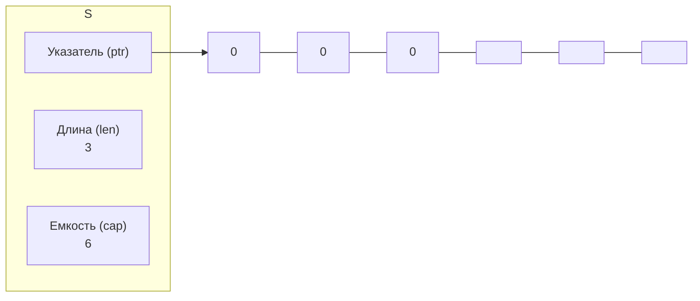
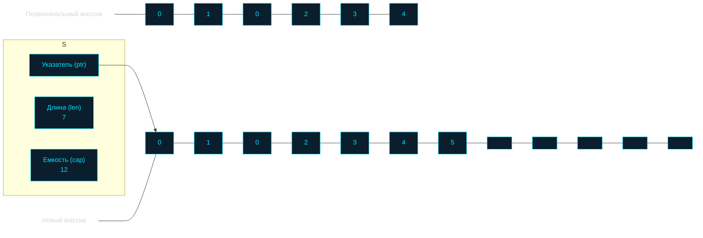
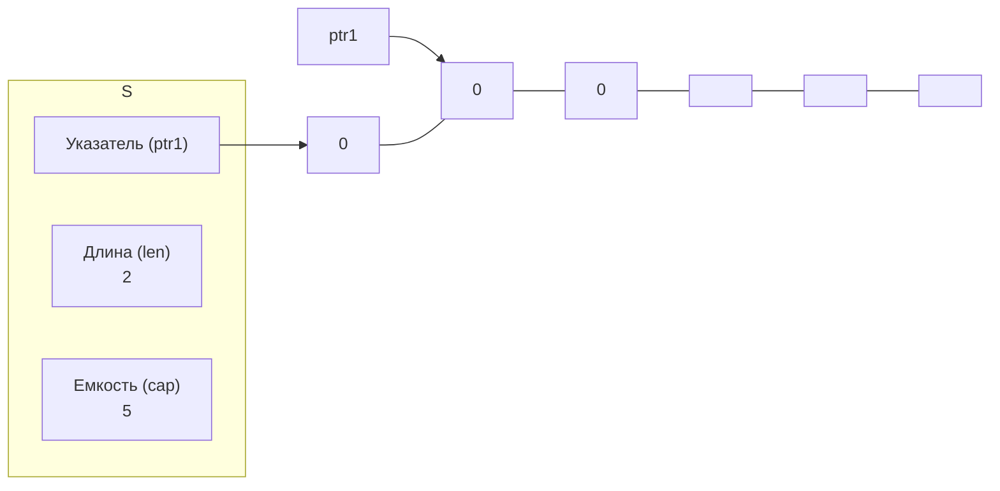
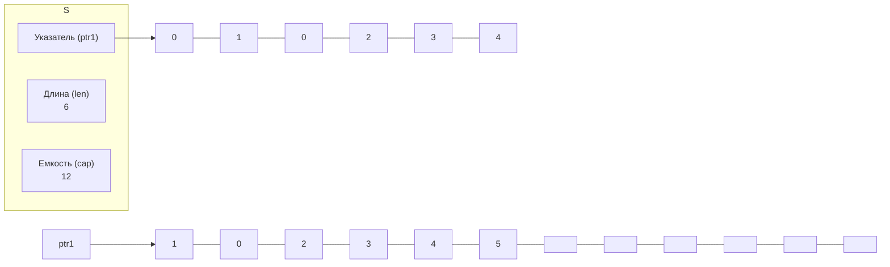

# Слайсы

## Устройство среза
```go
type slice struct{
    // указатель на первый элемент базового массива
    data *unsafe.Pointer
    // количество элементов в срезе
    len int
    // общая доступная ёмкость среза
    cap int
}
```

- Инициализация слайса из 3 элементов и capacity=6


## При исчерпании ёмкости
Когда массив заполняется, Go создаёт новый массив с увеличенной емкостью. Затем все элементы копируются в новый массив, и добавляется новый элемент. Если на предыдущий массив нет ссылок, то он освобождается сборщиком мусора.



## При нарезании слайсов
То есть указатель на тот же массив, но с меньшей ёмкостью и длиной. Соответственно, при изменении элемента в слайсе он измениттся и в другом слайсе.



Однако, если мы добавим элемент в s2, он не повлияет на s1, так как длина s2 изменится, но не затронет s1.

## Важно при пересоздании массивов
Когда срезы разделяют один массив, важно помнить, что изменения в одном срезе могут повлиять на другой. Однако, если емкость исчерпана, Go создает новый массив для одного из срезов, и они больше не будут связаны:


- Таким образом указывают на разные массивы

## Нулевые и пустые срезы
- У пустого среза длина 0
- У нулевого среза значение nil

### Создание срезов
- var s []string // Вариант 1 - нулевой срез
- s = []string(nil) // Вариант 2 - также нулевой срез
- s = []string{} // Вариант 3 - пустой, но не нулевой срез
- s = make([]string, 0) // Вариант 4 - аналогично варианту 3

### Особенности использования
-  Нулевые срезы не требуют выделения памяти, что делает их более эффективными по сравнению с пустыми срезами.
- Функция append() работает одинаково хорошо как с нулевыми, так и с пустыми срезами
- При возврате среза из функции предпочтительнее использовать нулевой срез, если нет необходимости в конкретной инициализации
- Когда заранее известна длина среза, рекомендуется использовать make()

### Возвращение срезов
Функция с сигнатурой []T может возвращать и пустой срез, и nil.
И при этом в вызывающем коде их нужно обрабатывать одинаково — через len()

## Особенности работы с append
```go
s1 := []int{1, 2, 3}
s2 := s1[1:2]
s3 := append(s2, 10)
```

Вернёт:
```go
// s1 = [1 2 10]
// s2 = [2]
// s3 = [2 10]
```
Append работает следующим образом:
- Проверяет, есть ли свободная емкость в базовом массиве
- Если есть — обновляет существующий массив
- Если нет — создает новый массив

В нашем случае s2 имеет емкость 2 при длине 1, поэтому append просто обновил общий базовый массив, изменив значение третьего элемента и закинув указатель на весь базовый массив с append-ом к s3.

- Важно помнить, что если просто передать срез, то передастся указатель на тот же базовый массив -> решение: copy, [:2:2] - полное выражение среза.

## Утечка ёмкости
- Создание копии данных

```go
func getMessageType(msg []byte) []byte {
    msgType := make([]byte, 5)
    copy(msgType, msg)
    return msgType
}
```

### Неработающие случаи:
- Нарезка больших срезов или массивов может привести к значительному потреблению памяти
- Сборщик мусора не освобождает недоступные участки базового массива
- Полные выражения среза не решают проблему утечек памяти

## Утечки памяти при работе с слайсами и указателями
Допустим есть срезы, содержащие элементы-указатели или структуры с полями-указателями

```go
type Foo struct{
    val []byte
}

// срез ссылается на базовый массив, каждый элемент Foo
// содержит поле v — это указатель на отдельный массив,
// сборщик мусора видит, что базовый массив все еще используется 
// и не может освободить память под "лишние" элементы
func keepFirstTwoElementsOnly(foos []Foo) []Foo {
    return foos[:2]
}

func main(){
    ...
    s := make([]Foo, 1000)
    s = keepFirstTwoElementsOnly(s)
}

// Решение: так же через копирование разорвать связь с старым массивом
func keepFirstTwoElementsOnly(foos []Foo) []Foo {
    arr := make([]Foo, 2)
    copy(arr, foos)
    return arr
}

```

- Решается так же через копирование

- В каждом из двух случаев сохранялся указатель на базовый массив большой ёмкости, даже при изменении capacity[:5:5]

